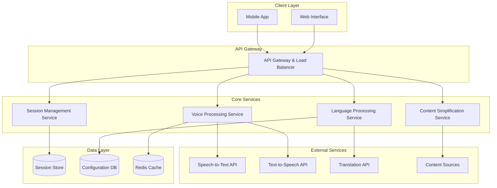

# Design Document: LokVaani Multilingual Voice-First AI Platform

## Overview

LokVaani is designed as a cloud-native, multilingual voice-first AI platform that provides accessible digital content consumption through natural language interactions. The platform follows a microservices architecture with specialized components for voice processing, language handling, content simplification, and mobile-optimized delivery.

The system architecture prioritizes accessibility, scalability, and multilingual support while maintaining low latency for mobile-first users. Key design principles include:

- **Voice-First Design**: Natural speech interaction as the primary interface
- **Multilingual Core**: Native support for multiple regional languages with automatic detection
- **Content Simplification**: AI-powered conversion of complex information into accessible formats
- **Mobile-Optimized**: Responsive design optimized for mobile devices and varying network conditions
- **Accessibility-Centered**: Full support for assistive technologies and inclusive design patterns

## Architecture

The LokVaani platform follows a distributed microservices architecture deployed on cloud infrastructure:



### Architecture Patterns

**API Gateway Pattern**: Centralized entry point for all client requests, handling authentication, rate limiting, and request routing.

**Microservices Pattern**: Independent, loosely-coupled services that can be developed, deployed, and scaled independently.

**Event-Driven Architecture**: Asynchronous communication between services using message queues for improved scalability and resilience.

**Circuit Breaker Pattern**: Fault tolerance mechanism to handle external service failures gracefully.

## Components and Interfaces

### Voice Processing Service

**Responsibilities:**
- Speech-to-text conversion with noise handling
- Text-to-speech generation in multiple languages
- Audio quality optimization for mobile networks
- Voice input validation and error handling

**Key Interfaces:**
```typescript
interface VoiceProcessingService {
  convertSpeechToText(audioData: AudioBuffer, language?: string): Promise<SpeechResult>
  convertTextToSpeech(text: string, language: string, voiceSettings: VoiceConfig): Promise<AudioBuffer>
  detectLanguageFromSpeech(audioData: AudioBuffer): Promise<LanguageDetectionResult>
  validateAudioQuality(audioData: AudioBuffer): Promise<AudioQualityResult>
}

interface SpeechResult {
  text: string
  confidence: number
  detectedLanguage: string
  alternativeTranscriptions?: string[]
}
```

**External Dependencies:**
- Cloud-based STT services (Google Speech-to-Text, Azure Speech Services)
- Cloud-based TTS services with multilingual support
- Audio processing libraries for noise reduction

### Language Processing Service

**Responsibilities:**
- Automatic language detection from text and speech
- Language preference management
- Translation coordination
- Multilingual content routing

**Key Interfaces:**
```typescript
interface LanguageProcessingService {
  detectLanguage(input: string | AudioBuffer): Promise<LanguageDetectionResult>
  setUserLanguagePreference(sessionId: string, language: string): Promise<void>
  getUserLanguagePreference(sessionId: string): Promise<string>
  translateContent(content: string, targetLanguage: string): Promise<TranslationResult>
}

interface LanguageDetectionResult {
  primaryLanguage: string
  confidence: number
  alternativeLanguages: LanguageCandidate[]
}
```

### Content Simplification Service

**Responsibilities:**
- Complex content analysis and simplification
- Technical term explanation
- Content summarization
- Factual accuracy preservation

**Key Interfaces:**
```typescript
interface ContentSimplificationService {
  simplifyContent(content: string, targetAudience: AudienceLevel): Promise<SimplificationResult>
  generateSummary(content: string, maxLength: number): Promise<SummaryResult>
  explainTechnicalTerms(content: string): Promise<ExplanationResult>
  validateFactualAccuracy(originalContent: string, simplifiedContent: string): Promise<AccuracyResult>
}

interface SimplificationResult {
  simplifiedText: string
  complexityReduction: number
  preservedKeyPoints: string[]
  technicalTermsExplained: TermExplanation[]
}
```

### Session Management Service

**Responsibilities:**
- User session lifecycle management
- Conversation context maintenance
- User preference persistence
- Session timeout handling

**Key Interfaces:**
```typescript
interface SessionManagementService {
  createSession(deviceInfo: DeviceInfo): Promise<SessionInfo>
  updateSessionContext(sessionId: string, context: ConversationContext): Promise<void>
  getSessionContext(sessionId: string): Promise<ConversationContext>
  extendSession(sessionId: string): Promise<void>
  terminateSession(sessionId: string): Promise<void>
}

interface ConversationContext {
  previousQueries: QueryHistory[]
  userPreferences: UserPreferences
  currentTopic?: string
  contextualInformation: ContextualData
}
```

## Data Models

### Core Data Structures

```typescript
// User Session Model
interface UserSession {
  sessionId: string
  deviceInfo: DeviceInfo
  languagePreference: string
  createdAt: Date
  lastActivity: Date
  conversationContext: ConversationContext
  accessibilitySettings: AccessibilityConfig
}

// Voice Interaction Model
interface VoiceInteraction {
  interactionId: string
  sessionId: string
  inputType: 'voice' | 'text'
  inputData: string | AudioBuffer
  processedText: string
  detectedLanguage: string
  responseText: string
  responseAudio?: AudioBuffer
  timestamp: Date
  processingMetrics: ProcessingMetrics
}

// Content Processing Model
interface ContentProcessingRequest {
  requestId: string
  sessionId: string
  originalContent: string
  sourceLanguage: string
  targetLanguage: string
  simplificationLevel: AudienceLevel
  requestedFormat: ResponseFormat
}

// Language Configuration Model
interface LanguageConfig {
  languageCode: string
  displayName: string
  isSupported: boolean
  sttAvailable: boolean
  ttsAvailable: boolean
  translationAvailable: boolean
  voiceOptions: VoiceOption[]
}

// Accessibility Configuration Model
interface AccessibilityConfig {
  screenReaderSupport: boolean
  highContrastMode: boolean
  textSizeMultiplier: number
  audioSpeedMultiplier: number
  keyboardNavigationEnabled: boolean
  alternativeTextEnabled: boolean
}
```

### Data Storage Strategy

**Session Data**: Stored in Redis for fast access with configurable TTL
**Configuration Data**: Stored in PostgreSQL for consistency and complex queries
**Audio Data**: Temporarily stored in cloud storage with automatic cleanup
**Metrics Data**: Stored in time-series database for analytics and monitoring

## Correctness Properties

*A property is a characteristic or behavior that should hold true across all valid executions of a system—essentially, a formal statement about what the system should do. Properties serve as the bridge between human-readable specifications and machine-verifiable correctness guarantees.*

Before defining the correctness properties, I need to analyze the acceptance criteria from the requirements document to determine which ones can be tested as properties.

### Property 1: Voice-to-Text Conversion Accuracy
*For any* valid audio input containing speech, the Voice_Interface should convert it to text with measurable accuracy and provide confidence scores.
**Validates: Requirements 1.1**

### Property 2: Text Input Processing Consistency  
*For any* valid text input, the LokVaani_Platform should process it directly without modification or loss of information.
**Validates: Requirements 1.2**

### Property 3: Language Detection Universality
*For any* input in a supported language, the Language_Processor should correctly identify the language with appropriate confidence levels.
**Validates: Requirements 1.4, 2.1**

### Property 4: Session Preference Persistence
*For any* user session, once an input preference (voice or text) is established, it should remain consistent throughout the entire session unless explicitly changed.
**Validates: Requirements 1.5, 2.2**

### Property 5: Response Language Consistency
*For any* user interaction, all responses should be generated in the user's preferred language as set in their session.
**Validates: Requirements 2.4**

### Property 6: Content Simplification Preservation
*For any* complex content input, the simplified output should preserve all key factual information while reducing complexity measurably.
**Validates: Requirements 3.1, 3.4**

### Property 7: Technical Term Explanation Completeness
*For any* content containing technical terms, the Content_Simplifier should provide plain language explanations for all identified technical terms.
**Validates: Requirements 3.2**

### Property 8: Content Summarization Fidelity
*For any* lengthy content, the generated summary should preserve all key information points while reducing length by a measurable amount.
**Validates: Requirements 3.3**

### Property 9: Audio Control Availability
*For any* audio response, the platform should provide functional pause, replay, and speed adjustment controls.
**Validates: Requirements 4.3**

### Property 10: TTS Fallback Reliability
*For any* text-to-speech generation failure, the platform should provide the response as text and notify the user of the audio failure.
**Validates: Requirements 4.5**

### Property 11: Conversation Context Continuity
*For any* user session, conversation context should be maintained and accessible across all interactions within the session timeout period.
**Validates: Requirements 5.1, 5.2**

### Property 12: Session Timeout Notification
*For any* user session approaching timeout due to inactivity, the platform should notify the user before clearing the conversation context.
**Validates: Requirements 5.3**

### Property 13: Context Reset Functionality
*For any* user request to start a new conversation, the platform should clear previous context and establish a fresh conversation state.
**Validates: Requirements 5.4, 5.5**

### Property 14: Network Error Feedback
*For any* network connectivity issue, the platform should provide clear feedback about the connection status and available functionality.
**Validates: Requirements 6.2**

### Property 15: Interface Orientation Adaptation
*For any* device orientation change, the platform interface should adapt appropriately while maintaining all functionality.
**Validates: Requirements 6.4**

### Property 16: Touch Gesture Support
*For any* supported touch gesture, the platform should execute the corresponding action reliably.
**Validates: Requirements 6.5**

### Property 17: Response Time Compliance
*For any* simple query, the platform should respond within 3 seconds or provide progress indication if processing takes longer.
**Validates: Requirements 7.1, 7.2**

### Property 18: Load Management Transparency
*For any* high system load condition, the platform should queue requests appropriately and inform users of expected wait times.
**Validates: Requirements 7.4**

### Property 19: Assistive Technology Compatibility
*For any* interactive element, the platform should provide proper semantic markup and ARIA attributes for screen reader compatibility.
**Validates: Requirements 8.1**

### Property 20: Alternative Text Completeness
*For any* visual element, the platform should provide meaningful alternative text descriptions.
**Validates: Requirements 8.2**

### Property 21: Keyboard Navigation Completeness
*For any* interactive element, the platform should be accessible via keyboard navigation alone.
**Validates: Requirements 8.3**

### Property 22: Color-Independent Information
*For any* information conveyed through color, the platform should provide alternative non-color indicators.
**Validates: Requirements 8.4**

### Property 23: Accessibility Customization
*For any* accessibility setting adjustment (text size, contrast), the platform should apply the changes immediately and consistently.
**Validates: Requirements 8.5**

### Property 24: Error Message Clarity
*For any* system error or failure, the platform should provide clear, actionable error messages with suggested alternatives.
**Validates: Requirements 9.1, 9.2, 9.3**

### Property 25: Privacy-Preserving Error Logging
*For any* error that occurs, the platform should log sufficient information for debugging while excluding personally identifiable information.
**Validates: Requirements 9.5**

### Property 26: Source Attribution Consistency
*For any* information response, the platform should include source attribution and data recency information.
**Validates: Requirements 10.2**

### Property 27: Source Unavailability Handling
*For any* unavailable information source, the platform should notify users and suggest alternative sources or approaches.
**Validates: Requirements 10.3**

### Property 28: Source Authority Prioritization
*For any* information query with multiple available sources, the platform should prioritize official and authoritative sources over general web content.
**Validates: Requirements 10.4**

### Property 29: Conflicting Information Presentation
*For any* query with conflicting information from multiple sources, the platform should present multiple perspectives with clear source attribution.
**Validates: Requirements 10.5**

## Error Handling

The LokVaani platform implements comprehensive error handling across all components:

### Voice Processing Errors
- **Audio Quality Issues**: Automatic noise detection and user notification with retry options
- **Speech Recognition Failures**: Graceful degradation to text input with clear error messaging
- **Language Detection Uncertainty**: User confirmation dialogs with language selection options

### Content Processing Errors
- **Simplification Failures**: Fallback to original content with notification and explanation
- **Translation Errors**: Alternative translation services or manual language selection
- **Source Unavailability**: Alternative source suggestions and cached content when available

### Network and Infrastructure Errors
- **Connectivity Issues**: Offline mode activation with limited functionality
- **Service Timeouts**: Retry mechanisms with exponential backoff
- **Rate Limiting**: Queue management with user notification of wait times

### Session Management Errors
- **Session Expiration**: Graceful context preservation with user notification
- **Context Corruption**: Automatic context reset with user notification
- **Preference Conflicts**: User confirmation dialogs for preference resolution

## Testing Strategy

The LokVaani platform employs a comprehensive dual testing approach combining unit tests and property-based tests to ensure correctness and reliability.

### Property-Based Testing

Property-based testing will be implemented using **Hypothesis** (for Python components) and **fast-check** (for TypeScript/JavaScript components). Each correctness property defined above will be implemented as a property-based test with the following configuration:

- **Minimum 100 iterations** per property test to ensure comprehensive input coverage
- **Custom generators** for domain-specific data types (audio samples, multilingual text, session contexts)
- **Shrinking strategies** to identify minimal failing cases for debugging
- **Test tagging** with format: **Feature: lokvaani, Property {number}: {property_text}**

### Unit Testing Strategy

Unit tests complement property-based tests by focusing on:

**Specific Examples**: Known good/bad inputs with expected outputs
- Voice samples with known transcriptions
- Text in specific languages with expected translations
- Content with known simplification results

**Edge Cases**: Boundary conditions and corner cases
- Empty audio inputs
- Extremely long text content
- Unsupported language combinations
- Network timeout scenarios

**Integration Points**: Component interaction validation
- Service-to-service communication
- External API integration
- Database transaction handling
- Cache consistency

**Error Conditions**: Specific failure scenarios
- Malformed audio data
- Invalid session tokens
- External service unavailability
- Resource exhaustion conditions

### Test Data Management

**Multilingual Test Corpus**: Curated collection of text and audio samples across all supported languages
**Synthetic Data Generation**: AI-generated content for testing content simplification and translation
**Accessibility Test Scenarios**: Screen reader simulation and keyboard-only navigation tests
**Performance Benchmarks**: Response time baselines for different query types and system loads

### Continuous Testing Pipeline

**Pre-commit Hooks**: Fast unit tests and linting
**CI/CD Integration**: Full test suite including property-based tests
**Performance Regression Testing**: Automated performance benchmarking
**Accessibility Compliance Testing**: Automated WCAG 2.1 AA compliance verification

The testing strategy ensures that both individual components work correctly (unit tests) and that the system maintains its correctness properties across all possible inputs (property-based tests), providing comprehensive coverage for the multilingual, voice-first nature of the LokVaani platform.